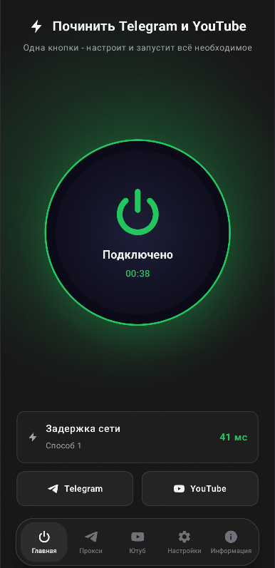
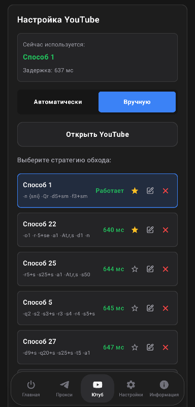

<div align="center">


<h1>NetFix Mobile</h1>

<p><b>Одна кнопка - и интернет снова работает. Прокси Телеграм (Proxy Telegram) и обход блокировок на телефоне и телевизоре.</b></p>

[](https://github.com/rupleide/NetFixMobile/releases/latest)
[](https://github.com/rupleide/NetFixMobile/releases/latest)
[](https://github.com/rupleide/NetFixMobile/releases)
[](https://t.me/NetFixRuBi)
[](https://app.tonkeeper.com/transfer/UQCx8X4z86Jej2hc8l_IVni8e0Q8uDHhC8_PJ2zymxngVc2Q)
[](LICENSE)

</div>

---

## 💡 О проекте

Блокировки давно перестали быть проблемой одного только компьютера. YouTube тормозит на телевизоре, Telegram не грузит фото на телефоне в мобильной сети - и если на десктопе с этим уже давно разобрался **NetFix**, то на Android до сих пор приходилось вручную возиться с консольными утилитами вроде `byedpi` и настраивать прокси Телеграм (Proxy Telegram) вручную. Задача явно не для обычного пользователя.

**NetFix Mobile** - официальный мобильный клиент, построенный по тем же принципам, что и **[NetFix для Windows](https://github.com/rupleide/NetFix)**. Внутри одного APK содержится обход DPI и встроенный локальный **TgWsProxy Android** (прокси Телеграм / Proxy Telegram), работающие как два независимых сервиса. Приложение само тестирует сеть, подбирает рабочую конфигурацию под вашего провайдера и запускает всё в один клик - без танцев с бубном и понимания того, что такое DPI вообще.

> [!NOTE]
> **От автора:** Мобильная версия переносит философию «просто нажми кнопку» на Android - и на телефоны, и на телевизоры. Отдельно следил за тем, чтобы интерфейс одинаково удобно управлялся и пальцем на экране, и обычным пультом от Smart TV. Задача та же, что и с десктопной версией: запустить надежный прокси Телеграм (Proxy Telegram) через TgWsProxy Android и починить работу медиа, не заставляя пользователя разбираться в сетях.

<div align="center">


</div>

---

## 📥 Скачать

<div align="center">

| Источник | Ссылка |
|:---:|:---:|
| 🚀 GitHub (рекомендуется) | **[Скачать последнюю версию](https://github.com/rupleide/NetFixMobile/releases/latest)** |
| ☁️ Google Drive (зеркало) | **[Открыть зеркало](https://drive.google.com/file/d/1E9Pi78AENQCnEthh4lTzn_ZQdZvhjOpy/view)** |

</div>

### 📋 Системные требования:
*   **ОС:** Android 8.0 (API 26) и выше.
*   **Архитектуры:** `arm64-v8a`, `armeabi-v7a`, `x86`, `x86_64`.
*   **Совместимость:** смартфоны, планшеты, ТВ-приставки и телевизоры на Android TV / Google TV.
*   **Разрешения:** при первом запуске система попросит подтвердить создание VPN-туннеля (стандартный диалог Android) - это нужно для работы обхода DPI.

---

## 📢 Telegram-канал проекта

> [!IMPORTANT]
> Все новости по NetFix, и десктопной версии, и мобильной - публикуются в одном канале. Рабочие стратегии обхода под конкретных провайдеров, конфиги, которые стоит попробовать в первую очередь, и анонсы обновлений, всё там.
>
> <a href="https://t.me/NetFixRuBi" target="_blank">
>   
> </a>

---

## 🛡 Безопасность

> [!CAUTION]
> Приложения, которые лезут в сетевые настройки и просят VPN-разрешение, всегда вызывают вопросы. Отвечу прямо.

- **Здесь НЕТ вирусов.** Заражать устройства собственных пользователей нет никакого смысла.
- **Чистые ядра:** приложение использует оригинальные нативные наработки обхода блокировок и локального прокси Телеграм (Proxy Telegram) из проектов **[romanvht/ByeByeDPI](https://github.com/romanvht/ByeByeDPI)** and **[amurcanov/tg-ws-proxy-android](https://github.com/amurcanov/tg-ws-proxy-android)**.
- **Прозрачность:** NetFix Mobile - это просто удобная оболочка для управления обходом и службой **TgWsProxy Android** (прокси Телеграм / Proxy Telegram). Исходный код доступен для проверки полностью.
- **VirusTotal:** проверка появится здесь сразу после первого стабильного релиза APK.

---

## 🚀 Как это работает / Быстрый старт

<div align="center">

<table border="0" cellpadding="12">
  <tr>
    <td width="50%" align="center" valign="top">
      <br/><br/>
      <b>⚡ Главный экран</b><br/>
      <i>Запуск обхода DPI (ByeByeDpi) и встроенного прокси в одну кнопку. Статус сети и пинг - в реальном времени.</i>
    </td>
    <td width="50%" align="center" valign="top">
      <br/><br/>
      <b>📺 Стратегии YouTube</b><br/>
      <i>Список протестированных стратегий обхода с пингом и возможностью добавить в избранное.</i>
    </td>
  </tr>
</table>

</div>

---

## ⚙️ Дополнительные возможности

*   **Watchdog-служба:** фоновый процесс следит за состоянием сети и удерживает туннель активным при переключении между Wi-Fi и мобильным интернетом.
*   **Автостарт:** обход можно запускать автоматически при включении устройства - особенно удобно для ТВ-приставок, к которым не всегда есть доступ с пульта.
*   **Исключения приложений:** можно выбрать, какие программы идут через обход DPI, а какие - напрямую, без лишней нагрузки на туннель.

---

## 🔮 Будущее проекта

Мобильная версия развивается параллельно с десктопным NetFix - часть решений и стратегий обхода приходит именно оттуда. В планах - донастройка под разные модели Smart TV и постепенный перенос удобных фич из десктопной версии туда, где это имеет смысл на Android.

> *Следите за Telegram-каналом - анонсы там появляются раньше, чем релизы.*

---

## 🛠️ Для разработчиков

Если хотите собрать приложение самостоятельно или внести изменения:

```bash
git clone https://github.com/rupleide/NetFixMobile.git
```

### 📋 Требования:
*   **IDE:** Android Studio (Baklava или новее).
*   **NDK:** версия `30.0.14904198` (для сборки нативного C-модуля ByeByeDpi / `hev-socks5-tunnel`).
*   **Rust:** `cargo-ndk` (для пересборки Rust-ядра `tg-ws-proxy` под платформы Android).

---

> [!CAUTION]
> ### 🚫 Пожалуйста, не создавайте отдельные форки NetFix Mobile
>
> Форки распыляют доверие пользователей: непонятно, какая сборка настоящая, обновления и фиксы до людей не доходят. Если есть идея, улучшение или найден баг - откройте Pull Request или напишите лично в Telegram. Отвечаю всем, и стоящие изменения попадают в проект с указанием вашего авторства - так его увидят все пользователи NetFix Mobile, а не только те, кто наткнулся на форк.

<div align="center">
<br/>

[](https://github.com/rupleide/NetFixMobile/pulls)
&nbsp;
[](https://t.me/rupleide)

</div>

---

## 💎 Поддержать проект

*Если NetFix Mobile помог вам - можно поддержать разработку донатом*

<div align="center">
<br/>

<table border="0" cellpadding="24" width="700">
  <tr>
    <td align="center" valign="middle" width="350">
      <h3>💎 Toncoin (TON)</h3>
      <code>UQCx8X4z86Jej2hc8l_IVni8e0Q8uDHhC8_PJ2zymxngVc2Q</code>
      <br/><br/>
      <a href="https://app.tonkeeper.com/transfer/UQCx8X4z86Jej2hc8l_IVni8e0Q8uDHhC8_PJ2zymxngVc2Q">
        
      </a>
    </td>
    <td align="center" valign="middle" width="350">
      <h3>⚡ Перевод по СБП</h3>
      <i>Работает с любого банка России</i>
      <br/><br/>
      <a href="https://www.tbank.ru/rm/r_eELpDmupvc.SCiWRkVJON/bgKkD30493/">
        
      </a>
    </td>
  </tr>
</table>

<br/>

❤️ Каждый донат мотивирует продолжать развитие проекта. Спасибо!

</div>

---

## ⚠️ Официальные источники

Единственный официальный репозиторий: [github.com/rupleide/NetFixMobile](https://github.com/rupleide/NetFixMobile)
Официальный Telegram-канал: [t.me/NetFixRuBi](https://t.me/NetFixRuBi)

Если вы обнаружили репозиторий или сборку, имитирующую NetFix Mobile - сообщите через GitHub DMCA:
[https://support.github.com/contact/dmca-takedown](https://support.github.com/contact/dmca-takedown)

> [!CAUTION]
> ### 📜 ЛИЦЕНЗИЯ ОБЯЗАТЕЛЬНА К ПРОЧТЕНИЮ АВТОРАМ ФОРКОВ

<details>
<summary><b>Раскрыть - условия GPL-3.0 + Section 7 Additional Terms</b></summary>
<br/>

Данное ПО распространяется под лицензией **GPL-3.0**.

На основании **Раздела 7 (Section 7)** лицензии GPL-3.0, к любым производным работам (модификациям, форкам, альтернативным сборкам) применяются следующие **дополнительные обязательные требования**:

*   **Исходный код (NetFix Mobile):** © 2024–2026 [rupleide](https://github.com/rupleide). Свободно для изменения и распространения при строгом сохранении оригинального авторства и открытости кода изменений.
*   **Сторонние компоненты:** все права принадлежат их оригинальным авторам. Данный проект - удобная оболочка, объединяющая нативные ядра обхода блокировок [romanvht/ByeByeDPI](https://github.com/romanvht/ByeByeDPI) и локального MTProto-прокси [amurcanov/tg-ws-proxy-android](https://github.com/amurcanov/tg-ws-proxy-android) (на базе Flowseal/tg-ws-proxy).

### ⚠️ Специальные требования к модифицированным версиям (Форкам)

Любое лицо или группа лиц, создающие форк NetFix Mobile, компилирующие изменённые исходники или распространяющие альтернативные сборки, **обязаны беспрекословно соблюдать следующие условия**:

1. **Запрет оригинального бренда (борьба с фейками):**
   - Запрещено использовать название **NetFix** или **NetFix Mobile** (а также любые названия, способные ввести пользователя в заблуждение относительно происхождения программы) в названии программы, репозитория, исполняемого файла (APK), папок, Telegram-каналов или сайтов. Проект должен быть полностью переименован.
   - Запрещено использовать оригинальный логотип NetFix Mobile и официальные промо-материалы. Использование логотипа, промо-материалов или значительных фрагментов README без изменений - нарушение авторского права и может быть предметом DMCA Takedown на платформе GitHub.

2. **Обязательное уведомление (Legal Notice) при запуске:**
   - На основании **GPL-3.0 Section 7(b) и 7(c)**, любой форк при первом запуске **обязан** отображать уведомление о неофициальном характере сборки со следующим текстом:
     **«ВНИМАНИЕ! Вы запускаете неофициальный форк программы NetFix Mobile. Оригинальный автор (rupleide) не имеет отношения к этой сборке, не гарантирует её безопасность и не оказывает поддержку. Оригинальный чистый NetFix Mobile доступен по адресу: github.com/rupleide/NetFixMobile»**
   - Вырезание этого уведомления - прямое нарушение лицензии.

3. **Обязательная маркировка и техническая изоляция:**
   - На основании **GPL-3.0 Section 7(c)**, в заголовке главного экрана приложения и в окне «О программе» форка должен постоянно и недвусмысленно отображаться текст: `(fork of NetFix Mobile by rupleide)`.
   - Любая модифицированная версия обязана изменить идентификатор пакета (Package ID / Application ID в build.gradle.kts) так, чтобы он не совпадал с оригинальным `com.rupleide.netfix`.

4. **Защита от недобросовестного сбора средств:**
   - На основании **GPL-3.0 Section 7(d)**, запрещается использовать имя оригинального автора (rupleide) или оригинальное название NetFix Mobile для рекламы, продвижения или сбора пожертвований.
   - Если форк содержит кнопки пожертвований, форкер обязан либо оставить оригинальные реквизиты автора (`rupleide`), либо полностью удалить их и переименовать раздел сборов под свой бренд. Подмена реквизитов на свои с сохранением текста о поддержке оригинального проекта NetFix/rupleide запрещена как искажение происхождения ПО.

5. **Обязательное и одновременное раскрытие исходного кода:**
   - В соответствии с GPL-3.0 Section 6, при публикации любого скомпилированного релиза (APK) форкер **обязан одновременно с публикацией бинарника** предоставить прямую, рабочую ссылку на открытый исходный код всех изменений на GitHub.
   - Запрещается распространять скомпилированные бинарники без одновременно опубликованного и доступного исходного кода. Любой релиз без публично доступных исходников - прямое нарушение лицензии.

---

**Юридические последствия и бан:**
Любое нарушение данных правил (например, удаление обязательного предупреждения при старте, сохранение названия NetFix Mobile или скрытие исходного кода) аннулирует право на использование и распространение кода проекта.

Нарушающие репозитории будут **немедленно заблокированы** администрацией GitHub через официальную процедуру **DMCA Takedown Notice** без предварительных уведомлений.

</details>

**Отказ от ответственности:** программа предоставляется «как есть». Автор не несёт ответственности за последствия использования ПО. Используя NetFix Mobile, вы подтверждаете, что делаете это на свой страх и риск.

---

<div align="center">
  <sub>Разработано с ❤️ для тех, кто хочет просто нажать на кнопку</sub><br/>
  <sub>v1.0.1 · 2026</sub>
</div>
